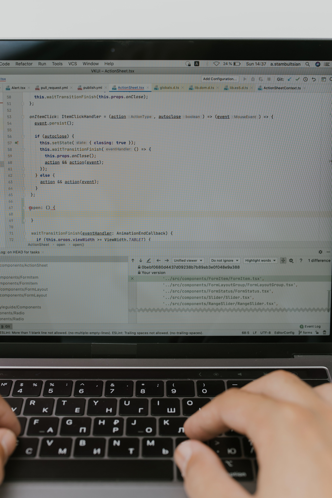

## The Post-Grad Challenge {text-align="center"}

Do you feel lost among thousands of confusing job descriptions? Not sure which skills to highlight to make your career take off?
We know the struggles:

- **Academic Gap:** Academic theory often doesn't speak the same language as companies.
- **Information Overload:** Too many job postings, not enough clarity.
- **Career Path Anxiety:** "What can I actually do with my current skills?"

---

## Map Your Skills {text-align="center"}

::: {.columns}

::: {.column width="60%"}
Our **Interactive Simulator** allows you to test your professional profile in real-time.

Select your preferred tools, from **Python** to **Social Media Management**, and immediately discover which digital market roles match your profile.

### It's not magic, it's **Data Science** at the service of your future.
:::

::: {.column width="30%"}
{width="100%"}
:::

:::
---

## AI Assistant at Your Service {text-align="center"}

Navigating the job market can be overwhelming, but you don't have to do it alone. The integrated Virtual Assistant is ready to guide you directly on the **Jobs** page.

Our integrated **Virtual Assistant** acts as your personal career coach:

- **Instant Match**

- **Dynamic Algorithm**

- **User-Centric**

---

## Strategies to Win {text-align="center"}

To stand out in the modern digital recruitment landscape, a multi-layered approach is essential:

- **Data-Driven Match:** Aligning academic backgrounds with real-time market demands using automated filtering.

- **Skill Transparency:** Clearly identifying what top-tier employers are looking for right now.

- **Continuous Iteration:** Regularly updating profile data to match shifting corporate requirements.

---

## Boundless Opportunities {text-align="center"}

The digital market isn't crowded, it's just waiting for the right skills to connect with the right roles.

By translating complex data into actionable career paths, the **Digital Comm Career Hub** transforms uncertainty into a structured roadmap for professional growth.

---

## Ready to Take Off? {text-align="center"}

### Explore the Digital Comm Career Hub

Launch the application to start exploring tailored career paths, testing your skills, and talking to your AI coach.

[ **Launch Career Hub** ](https://web-comm-projectgit-3susr2nyp8semhqdonxv5k.streamlit.app/)

 

[ **Explore the Source Code on GitHub** ](https://github.com/Sara-garbini/web-comm-project)

{fig-align="center" width="40%" style="margin-top: 50px;"}

---

### Thank You for Your Attention! {text-align="center"}